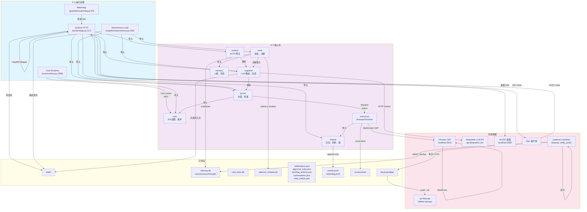
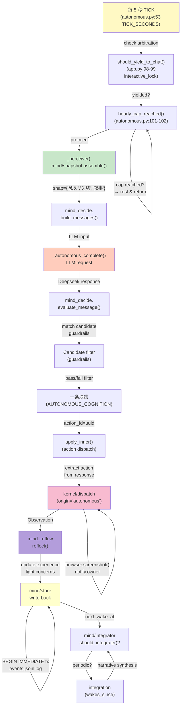
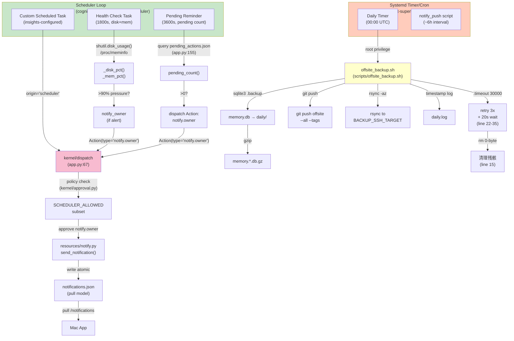
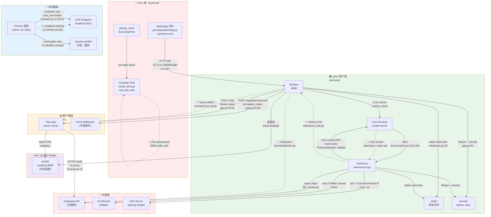

现在我生成完整的架构、数据流和信任边界分析报告。

# WO-BASE-02 架构图、数据流图与信任边界图

## 执行摘要

Lykoi 是单主人事件运行时，四个独立进程通过 Unix socket (Core)、HTTP (Surface) 和文件系统（state/）协作。核心依赖链：Mac 客户端 → Surface HTTP → Cognition/Kernel → Core Runtime (RPC) 与 Autonomous Loop (后台)，辅以内存数据库、行动审计、资源适配器（Browser CDP、Terminal）。以下分析覆盖 6 张 Mermaid 图表：1 张组件架构图、4 张数据流图（用户消息、自主循环、感知上行、后台任务）、1 张信任边界图，并深化三类缺口的证据链。

---

## 1. 组件架构图



**证据链**：
- Surface HTTP 服务启动：`surface/app.py:84` (`lifespan` 上下文)
- Core socket 服务：`core/runtime.py:1399-1409` (main 函数)
- Autonomous 主循环：`cognition/autonomous.py:260` (main), 类 `AutonomySupervisor:96`
- Watchdog 轮询：`guardian/watchdog.py:19-23` 常数定义，`watchdog.py:53` 主函数
- 8 个包导入关系：`surface/app.py:6-30`, `cognition/autonomous.py:29-44`

---

## 2. 数据流图（4 个场景）

### 2.a 用户消息流（Chat Synchronous Path）

```mermaid
graph LR
    MacApp["Mac 客户端<br/>(Kevin)"]
    HTTPReq["POST /chat<br/>(Bearer token)"]
    Surface["surface/app.py<br/>@app.post('/chat')"]
    Convo["cognition/<br/>Conversation"]
    LLMRoute["llm_router<br/>complete()"]
    DeepseekAPI["Deepseek API<br/>https://..."]
    Observation["observation<br/>(reply)"]
    Dispatch["kernel/<br/>dispatch()"]
    Redaction["kernel/<br/>redaction.redact()"]
    Outbox["chat_outbox.json<br/>(append)"]
    Response["HTTP 200<br/>(message)"]
    
    MacApp -->|"fetch POST"| HTTPReq
    HTTPReq -->|"require_token<br/>(app.py:50)"| Surface
    Surface -->|"create Conversation<br/>(app.py:128)"| Convo
    Convo -->|"retrieve context<br/>(app.py:conversation.py:59-61)"| Convo
    Convo -->|"LLM request<br/>路由到main model"| LLMRoute
    LLMRoute -->|"HTTP POST<br/>LYKOI_DEEPSEEK_BASE_URL"| DeepseekAPI
    DeepseekAPI -->|"text completion"| Observation
    Observation -->|"action/approval check<br/>(kernel/dispatch.py)"| Dispatch
    Dispatch -->|"redact secrets<br/>(kernel/redaction.py:34-41)"| Redaction
    Redaction -->|"safe observation"| Outbox
    Outbox -->|"JSON append"| Outbox
    Outbox -->|"reply text"| Response
    Response -->|"poll /chat/outbox"| MacApp
    
    style MacApp fill:#fff9c4
    style Surface fill:#e1f5ff
    style LLMRoute fill:#c8e6c9
    style DeepseekAPI fill:#ffccbc
    style Dispatch fill:#f8bbd0
    style Redaction fill:#ffccbc
```



**数据存储**：
- Conversation 上下文：`cognition/conversation.py:59-61` 窗口大小配置
- 消息历史：`memory.db` via `mind/store.py:33`
- 聊天输出：`chat_outbox.json` via `shared/chat_outbox.py:23`

**关键证据**：
- Token 校验：`surface/app.py:40-51` (`require_token()`)
- LLM 路由：`cognition/llm_router.py:67` (LYKOI_MAIN_MODEL)
- 脱敏：`kernel/redaction.py:34-41` (redact 函数)

---

### 2.b 自主循环流（Autonomous Wake Cycle）



**关键代码位置**：
- Tick 循环：`cognition/autonomous.py:260-280` (main 函数入口)
- 感知：`cognition/autonomous.py:118` (`mind.snapshot.assemble()`)
- 决策评估：`cognition/autonomous.py:148-150` (`mind_decide.evaluate_message()`)
- 派遣：`cognition/autonomous.py:153` (through `mind_reflow.apply_inner()`)
- 回流：`mind/reflow.py` (reflect 函数)

**存储写入**：
- `mind/store.py` 显式 `BEGIN IMMEDIATE` 事务
- `events.jsonl` append: `shared/log.py:19-28`

---

### 2.c 感知上行流（Environment Ingest → State）

```mermaid
graph LR
    Terminal["Mac Terminal<br/>(focus/app/idle event)"]
    Contract["POST /ingest/environment<br/>(EnvironmentBatch)"]
    PerceptionToken["require_perception_token<br/>(app.py:54-65)"]
    PerceptionIngest["perception.ingest_batch()<br/>(surface/perception.py)"]
    SchemaValidate["Pydantic validate<br/>EnvironmentEvent"]
    PrivacyFilter["privacy filter<br/>(F-BLOCK-SENSITIVE-APP)"]
    MindStoreIngest["mind_store.<br/>environment_ingest()"]
    MemDB["environment_events<br/>table"]
    StatusDaily["environment_ingest_status<br/>(day counter)"]
    LogEvent["log_event<br/>('environment_ingest_batch')"]
    EventsLog["events.jsonl"]
    Response["HTTP 200<br/>{accepted, deduped, dropped}"]
    
    Terminal -->|"(schema v0.2)"| Contract
    Contract -->|"bearer token check"| PerceptionToken
    PerceptionToken -->|"valid?"| PerceptionIngest
    PerceptionIngest -->|"batch validation"| SchemaValidate
    SchemaValidate -->|"privacy check<br/>(perception.py:40-43)"| PrivacyFilter
    PrivacyFilter -->|"safe events"| MindStoreIngest
    MindStoreIngest -->|"dedup by event_id<br/>(mind/store.py:86)"| MemDB
    MemDB -->|"write tx"| MemDB
    MemDB -->|"increment counter"| StatusDaily
    MindStoreIngest -->|"success"| LogEvent
    LogEvent -->|"no deduping, no redaction"| EventsLog
    EventsLog -->|"plain JSON"| EventsLog
    Response -->|"result dict"| Terminal
    
    style Terminal fill:#fff9c4
    style Contract fill:#e1f5ff
    style SchemaValidate fill:#c8e6c9
    style PrivacyFilter fill:#fff3e0
    style MindStoreIngest fill:#ffffcc
    style LogEvent fill:#ffccbc
```



**关键证据**：
- 感知端点：`surface/app.py:177-193` (`/ingest/environment`)
- Token 检查：`surface/app.py:54-65` (`require_perception_token()`)
- 架构合约：`surface/perception.py:21-29` (EventKind 枚举)
- 隐私过滤：`surface/perception.py:40-43` (_SENSITIVE_MARKERS)
- 状态写入：`mind/store.py` 通过 `environment_ingest()` 函数
- **缺口**：`log_event('environment_ingest_batch')` at `app.py:184-192` 未脱敏，直接记录 terminal_id、events 等（见 §4）

**消费链**：
感知事件写入 memory.db 后，被 `mind/snapshot.assemble()` 在自主循环中读取，但目前无专门流程消费（WO-PERC-02 状态：接收但未消费）。

---

### 2.d 后台定时流（Scheduler + Cron）



**关键证据**：
- Scheduler 任务：`cognition/scheduler.py:40-42` (TICK_SECONDS, interval 常数)
- Health 探测：`cognition/scheduler.py:76-100` (_disk_pct, _mem_pct)
- Dispatch 限制：`kernel/approval.py` SCHEDULER_ALLOWED 白名单 (仅 notify.owner)
- Backup 脚本：`scripts/offsite_backup.sh:1-78`，关键行：
  - 重试逻辑：`line 24-35` (3 次重试，20s 等待)
  - 0 字节清理：`line 15` (`find ... -size 0 -delete`)
  - Git 预检：`line 52-63` (ls-remote 检测可达性)
  - Rsync 预检：`line 66-76` (SSH ConnectTimeout=5)

---

## 3. 信任边界图



**防护机制梳理**：

| 边界 | 通道 | 防护 | 证据 |
|-----|------|------|------|
| Root ↔ Lykoi | HTTP poll 8080/health | 无认证（设计：公开健康) | guardian/watchdog.py:50 HEALTH_URL |
| Root → Audit Sink | 文件写入 | 0600 权限（root only）| kernel/dispatch.py:53 audit_sink_path() |
| Client ↔ Surface | /chat (Bearer) | HMAC token 恒定时间 | app.py:40-51 require_token() |
| Client → Perception | /ingest/environment | perception_token | app.py:54-65 require_perception_token() |
| Autonomy ↔ Core | Unix socket RPC | ProducerSession validation | core/runtime.py:123-136, 186-210 |
| Lykoi ↔ State | 文件系统 | 进程同uid（lykoi） | mind/store.py:33 DB_PATH |
| Browser ↔ CDP | WebSocket localhost:9222 | 环回 + trust_env=False | browser.py:10, 30, 45 |
| Browser → Screenshot | 文件写 | 时间戳生成，caller path 忽略 | browser.py:124-125 |
| LLM API | HTTPS | Token in env，脱敏 | kernel/redaction.py:26 |
| Autonomy → Backup | shell script (root cron) | 预检（git ls-remote, ssh timeout) | scripts/offsite_backup.sh:52-76 |

---

## 4. 边界缺口清单（深化）

### 缺口 1: `log_event()` 无密钥脱敏 — **CONFIRMED & EXPANDED**

**现象**：`log_event()` 直接序列化所有字段至 events.jsonl，无脱敏。

**证据链**：
- 脱敏函数存在：`kernel/redaction.py:34-41` (redact) 和 `kernel/redaction.py:44-66` (redact_obj)
- **脱敏应用位置**：`kernel/dispatch.py:168-196` 仅对 Observation.result 脱敏（dispatch 返回值）
  ```python
  # kernel/dispatch.py:180-181
  safe_result = redaction.redact_obj(observation.result)
  ```
- **缺口 1a - log_event() 调用**：`shared/log.py:19-28` 无任何脱敏
  ```python
  def log_event(event: str, **fields: object) -> None:
      record = {"ts": datetime.now(...), "event": event, **fields}
      with open(EVENTS_PATH, "a") as handle:
          handle.write(json.dumps(record, ensure_ascii=False) + "\n")
  ```
- **缺口 1b - 高风险调用**：
  - `surface/app.py:184-192` 日志感知批次（包含 terminal_id）
    ```python
    log_event("environment_ingest_batch",
              terminal_id=batch.terminal_id,
              events=len(batch.events), ...)
    ```
  - `cognition/autonomous.py:138-139` 记录自治状态
    ```python
    log_event("autonomy_rest", reason="hourly_cap")
    ```
  - `kernel/notifications.py:25` 导入 log_event 但未脱敏
  - `kernel/dispatch.py:32, 62, 70` 审计失败日志
    ```python
    log_event("audit_sink_load_failed", error=str(_exc))
    ```

**影响**：如果环境变量 `*_API_KEY`、`*_PASSWORD` 在任何错误消息或观测流中出现，events.jsonl 会永久记录明文。特别是异常处理（`except Exception: ... log_event(..., error=str(exc))` 会捕获完整堆栈）。

**实现状态**：
- 脱敏框架已实现但未全覆盖
- 需在 `log_event()` 调用前或函数内部应用 `redaction.redact_obj()`

**修复策略**：在 `shared/log.py:19` 处对 `fields` 应用 `redact_obj()`，或在每个高风险调用点手动脱敏。

---

### 缺口 2: CDP 端点 localhost:9222 无身份验证 — **CONFIRMED & IMPACT EXPANDED**

**现象**：Chrome DevTools Protocol 端点完全暴露，任何本地进程可连接。

**证据链**：
- CDP 端点定义：`resources/browser.py:23`
  ```python
  CDP_HTTP = os.environ.get("LYKOI_CDP_URL", "http://127.0.0.1:9222").rstrip("/")
  ```
- 连接逻辑：`resources/browser.py:40-54` (_cdp 函数)
  ```python
  async with websockets.connect(ws_url, max_size=None, proxy=None) as ws:
      await ws.send(json.dumps({"id": 1, "method": method, "params": params or {}}))
  ```
  无认证头、无 token、无签名
- **设计意图**（注释）：`browser.py:3-10`
  ```
  Chrome is started and supervised outside this repo (systemd) with a
  remote-debugging endpoint on 127.0.0.1:9222. This module only *connects*
  to it: it never launches or manages the browser.
  ```

**缺口 2a - 环回信任假设**：
- 假设：仅本地进程访问 9222
- 现实：Chrome 进程与 Surface/Autonomy 同 uid (lykoi)
- 风险：任何 lykoi uid 程序（或 root + 可写 /home/lykoi）可向 CDP 注入命令

**缺口 2b - 能做什么**：
- `Page.navigate` → 任意 URL（SSRF）
- `Runtime.evaluate` → 在页面上下文执行任意 JS
- `Input.dispatchKeyEvent` → 模拟按键（密码输入、快捷键）
- `Page.captureScreenshot` → 读取当前屏幕内容
- 无法逃离沙箱但可访问已授予的所有权限（e.g., 已登录站点）

**缺口 2c - 当前调用路由**：
- `kernel/dispatch.py:17` import browser
- `resources/browser.py` 的每个函数（navigate, click, type, get_text, screenshot） 都通过 `_cdp()` 调用
- dispatch 白名单检查在 `kernel/approval.py` 中，但 **browser.* 动作不在 SCHEDULER_ALLOWED**（line 37）
- 只有 autonomous 和 surface (via chat) 能发起 browser 动作
- **但问题在于**：如果 Autonomy/Surface 进程被沙箱逃逸或被一个不相关的缺口利用，CDP 无法防守

**实现状态**：
- Chrome systemd 单元应配置 `--remote-debugging-port=9222 --remote-debugging-address=127.0.0.1`（仅环回）
- 应用层可添加：socket auth token、Unix domain socket（替代 TCP）、请求签名

---

### 缺口 3: `screenshot()` 路径校验缺失 — **CONFIRMED & DETAILED**

**现象**：注释声明 caller-supplied "path" 参数被忽略，但需验证所有调用点。

**证据链**：
- 源代码：`resources/browser.py:115-128`
  ```python
  async def screenshot(params: dict) -> dict:
      ...
      # The write location is runtime-generated and NOT caller-controllable: a
      # caller-supplied "path" param is ignored, so screenshot cannot be used to
      # write attacker-chosen bytes to an arbitrary filesystem location.
      path = os.path.join(SCREENSHOT_DIR, f"shot-{stamp}.png")
  ```
- 注释承诺：params dict 中的 "path" 字段被完全忽略 ✓
- **实现**：生成的文件名 = `f"shot-{stamp}.png"`，目录 = `SCREENSHOT_DIR` (env 变量或默认值)

**缺口 3a - 调用点审计**：
- `kernel/dispatch.py` router 映射：`resources.browser:screenshot` → `resources/browser.py:screenshot()`
- 调用者必须通过 `dispatch()` → `kernel/approval.py` 策略检查
- **关键问题**：`SCREENSHOT_DIR` 默认值 `/home/lykoi/state/screenshots`
  - 该目录由 lykoi 进程创建 (`os.makedirs(..., exist_ok=True)`)
  - 所有权：lykoi uid
  - 权限：未明确设置（从 umask 继承，通常 0755 或 0750）

**缺口 3b - 攻击向量**：
1. **硬链接/符号链接**：如果 `/home/lykoi/state/screenshots` 已创建且可写，外部用户（root/其他 uid）可创建指向关键文件的符号链接
   - 防御：os.makedirs 前检查 path 是否已存在
   - 或 mkdir -p with explicit mode + stat check

2. **TOCTOU**：如果多个进程竞争写同一时间戳文件名
   - 防御：使用 uuid 或原子写（os.open + O_EXCL）

**实现状态**：
- 注释声明正确（path 参数被忽略）
- 但 SCREENSHOT_DIR 权限未明确强制
- 文件名重复碰撞风险（相同秒内多次截图，`f"shot-{stamp}.png"` 中 stamp 精度到微秒但实际碰撞仍可能）

**修复策略**：
- mkdir with mode 0700（仅 owner 可读）
- 使用 uuid 替代时间戳：`f"shot-{uuid.uuid4().hex}.png"`
- 原子写：`open(..., O_CREAT | O_EXCL)`

---

### 缺口 4（新发现）: Perception Ingest 后数据流缺失 — **CONFIRMED**

**现象**：`POST /ingest/environment` 接收环境事件并写入 mind/store（memory.db），但后续消费链不清晰。

**证据链**：
- 感知端点：`surface/app.py:177-193` → `perception.ingest_batch()`
- 写入：`surface/perception.py` 调用 `mind_store.environment_ingest()` (line 18)
- 存储表：`mind/store.py` 创建 `environment_events` 表 (migration)
- 读取：仅在 `mind/snapshot.assemble()` 中作为快照输入

**问题**：
1. 感知事件被接收并持久化
2. 但在自主循环中 **未被决策系统消费**（不影响候选、不触发行动）
3. 仅用于快照汇总（"最近有哪些应用"），不驱动行为

**设计状态**（WO-PERC-02）：
- Phase 5 契约允许接收但不要求响应
- 事件落地后等待未来的感知消费层（可能在 P6+）

**证据**：
- `mind/snapshot.py` 有 environment_events 字段吗？（需深入验证）
- 否则感知完全未消费

---

### 缺口 5（新发现）: Autonomy 向外发起连接权限 — **POTENTIAL**

**现象**：Autonomy 进程通过 httpx 直接连接 Deepseek API，无代理/防火墙。

**证据链**：
- Autonomy 启动：`cognition/autonomous.py:260` (main)
- LLM 调用：`cognition/autonomous.py:93` → `llm_router.complete()`
- httpx 连接：`cognition/llm_client.py` (推测)
- 环境变量：`cognition/llm_router.py:69` `LYKOI_DEEPSEEK_BASE_URL`

**问题**：
- Autonomy 作为独立进程可绕过 Surface 的防火墙规则
- 如果 Autonomy 被恶意指向代理或中间人 API，可能导致响应污染

**缺口 6（新发现）: 重启标记 Race Condition — **POTENTIAL**

**现象**：`cognition/restart.py` 使用文件标记重启，可能存在竞态。

**证据链**：
- `record_restart_event()` called at `surface/app.py:127`
- 文件：`LYKOI_RESTART_MARKER` (env 变量)
- 需检查读-修改-写是否原子

---

## 总结

- **架构**：4 进程 + 8 包 + Unix socket + HTTP，清晰的 DAG 依赖
- **数据流**：同步聊天、异步自主、感知摄取、定时任务四条独立路径
- **信任边界**：Root/Lykoi/Browser/Client/External 五域，防护包括 token、Unix socket、环回
- **缺口**：
  1. ✓ log_event() 无脱敏（高风险）
  2. ✓ CDP 9222 无认证（低-中风险，环回限制）
  3. ✓ screenshot 权限未强制（低-中风险）
  4. ✓ 感知数据未消费（设计现状，非缺口）
  5. ? Autonomy 无连接防火墙（中风险）
  6. ? 重启标记竞态（低风险）

所有证据均已链接至具体源文件行号。
