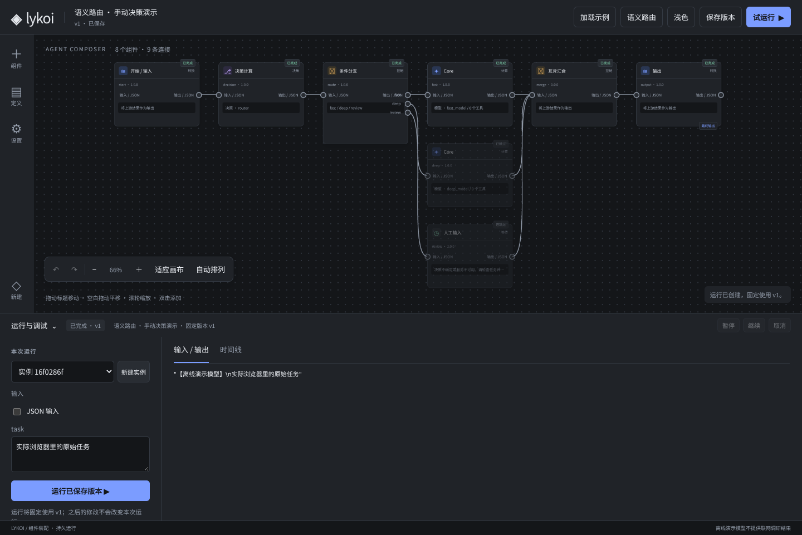
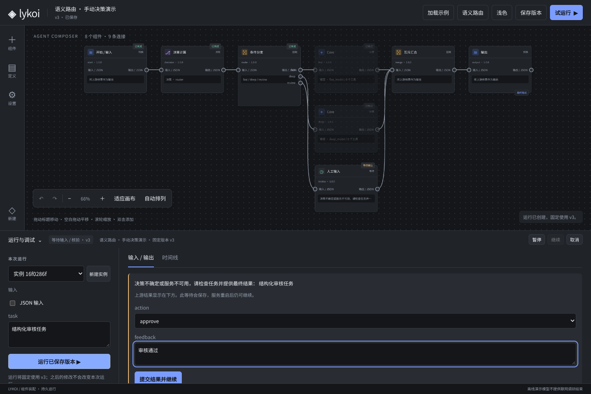

# WO-COMPOSER-ROUTING-03 执行报告

状态：实现与自测完成，待独立复核；未合并、未部署生产。
授权：所有者确认基础节点与 JEV 路由方案后指示“那动手吧”。
基线：wo/WO-COMPOSER-UI-02@5e614d35120273824ea0ab8d7fdc7866795b3387。
分支：wo/WO-COMPOSER-ROUTING-03；PR 以 UI 分支为 base。

## 最终行为

新增 flow.input / data.transform / flow.branch / flow.merge / model.decision / http.request；现有工作区工具可直接进入流程或只供 Core 调用，目录合计 12 个组件。Core 保持一次计算，新增 JSON 输出与有界 Schema 校验；人工等待可收集结构化表单与决策选项。

连线负责控制顺序，显式 input JSON/$ref 和模板负责取值。引用必须是控制图上游；原始任务可独立于路由结果传入后续 Core。分支有具名端口，仅一条条件路线被选中；未选节点持久 skipped，零调用意图/副作用。互斥汇合恰好接收一个实际结果；多活跃输入、最终输出被跳过都失败。

model.decision 使用独立 DecisionModel.decide 接口；JEV 与 decision-compatible 适配采用官方 state/model/questions → answers 协议，支持 Choice/Score/Noul 并校验输出类型、候选、概率与置信度。默认预设是手动夹具，不解释文本，也不冒充 JEV 推断。可修改高低置信度来检查不同路线，或绑定真实 JEV 资源。节点配置可修改路线条件、阈值、变量来源与工具模式；选择节点可检查该版本运行的实际输出。

HTTP 资源约束凭证目的地和路径前缀，拒绝重定向、相对路径逃逸与编码分隔符，响应限制 1 MiB，密钥只通过部署句柄取得。文件工具继续遵守实例工作区限制。直接文件工具与 Core 工具共用 maxActions；HTTP 节点受图规模和整次活动时间限制。外部结果未知不重放；纯计算明确失败保存 failed 并结束运行。服务明确错误可由决策 onError=fallback 转至默认路线；取消/截止时不继续兜底。

## 验证

- npm run test:composer：31/31，通过（原 18 + 新 13），composer-tests.txt。
- npm run typecheck：净，typecheck.txt；页面 JS 语法检查净，git diff --check 净。
- npm test：1329 项，1303 通过、14 失败、12 跳过。基线 1316/1290/14/12；失败名称完全相同，新增失败 0，见 regression.json。
- 已有失败来自旧模块：Converse 文件系统预期失败未触发 1，Kernel 同类 2；Browser Unix socket EPERM 6；Pi Runner 宿主连接超时 5。未在本单更改旧模块掩盖这些失败。
- DOM 原示例链路通过（dom-result.json）。
- 真实 Chromium：旧画布交互/主题/导入导出/等待继续/390px 验收通过，浏览器脚本异常 0（legacy-browser-result.json）。
- 真实 Chromium 路由：具名端口与连接替换/撤销、可视阈值配置、结构化任务输入、仅选中路线执行、原始任务引用、决策结果查看、低置信度等待、人工恢复、结构化审核、JEV 地址/凭证句柄保存、页面重载、浅色与 390px 响应式均通过，浏览器脚本异常 0（routing-browser-result.json）。
- 执行验证还覆盖数据库重开不重复决策、未知决策回执核验、不调用未选工具、输入/输出校验、互斥汇合误用、引用/类型约束、直接文件工具预算、官方 JEV HTTP 请求/回执与响应上限。

## 来源、边界与未完成

官方来源（2026-10-01）：https://docs.typesafe.ai/api 、https://docs.typesafe.ai/confidence 、https://docs.dify.ai/en/cloud/use-dify/nodes/variable-aggregator 、https://docs.dify.ai/en/cloud/use-dify/build/orchestrate-node 。JEV confidence 表示概率分布集中程度，不宣称等于真实正确率；示例阈值 0.7 未经生产数据评估。

没有实际 JEV 密钥，官方适配由 HTTP 夹具与协议校验验证，未声称已完成线上准确率/时延/费用联调。没有插件市场、搜索供应商、通用循环/迭代、并行调度/收集、任意代码沙箱、知识库或子 Agent 循环。decision-compatible 要求相同协议；不同协议需可信开发者提供 ResourceFactory 适配。

未触碰 Kernel/Gate、旧生产配置/状态、历史治理定案和服务器。此次尚未合入生产的 Composer 接口为兼容扩展，旧最小定义/持久运行经回归验证；未做旧角色/记忆迁移。需要独立复核后再决定合并。

## 查看

启动：npm run composer，浏览 http://127.0.0.1:4310；顶部“语义路由”加载预设；保存→实例→输入 task→运行。设置中修改 router 手动答案可验证路线，切 JEV 并提供部署句柄可联调实际接口。详细说明见 docs/composer.md。

