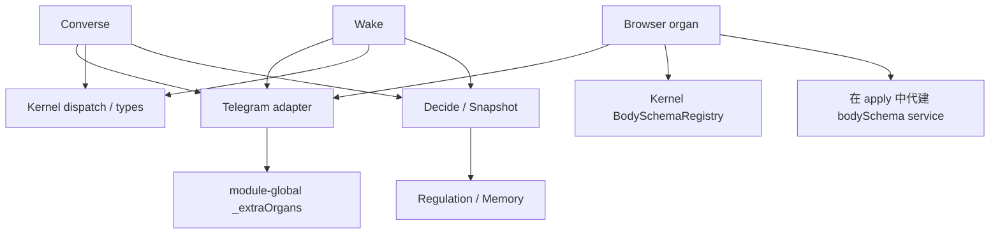

# 第一阶段：保留、删除、迁移清单

审查基线：`main@cd5bfad`（2026-09-09，本地主仓干净）。此处描述代码事实，不代表生产版本或生产验收。

用户确认的总顺序：迁移不变量先分类 → Runtime Slimdown → 插件解耦 → 防御审查 → Character Instance → 统一 Cognition → 能力系统 → Task 最小骨架 → Resolver → Delegation / Everything 与完整 Task → Forge → 身体与体验。

## 范围与证据

静态扫描覆盖 18 个包、97 个 src TypeScript 文件、31,937 行；43 条包间静态依赖边。识别 453 个含迁移线索的注释、212 个 catch、146 处防御关键词标识符。这些是检索线索，不能解释为 212 个缺陷或已完成全面防御审查。

原始依赖边及文件行号在 [inventory-before.json](inventory-before.json)，重跑命令：

```sh
node governance/wo/WO-RUNTIME-SLIMDOWN-01/inventory.mjs
```

统计不覆盖动态依赖、外部消费者或服务器资产。人工跟踪了下列关键调用链；其余分支与具体防御仍待分批审查。当前白皮书已通读；历史 Python 实现状态不作为当前能力事实。

## 当前依赖图与结构问题

箭头表示依赖/使用关系，不是授权流。以下是 43 条边中的本阶段关键部分。



1. `packages/lykoi-adapter-telegram/src/resources.ts` 的 `_extraOrgans` 是进程级 Map；Browser 通过 `registerOrganHandler` 写入，Converse/Wake 通过 `outboundOrganResources()` 各取资源快照。卸载注册不等于已取得的资源对象同步消失。
2. `packages/lykoi-organ-browser/src/index.ts:apply` 在缺少 bodySchema 时自行提供服务；`inject` 只要求 audit。服务的所有权和存在性取决于具体器官装载，无法支持多个独立 Runtime 的稳定能力视图。
3. `profile/cordis.prod.yml` 把 Browser 放在 Converse/Wake 前；后两者初始化时复制资源。当前代码靠初始化时序得到可用工具，不能仅把 YAML 顺序当作契约。
4. `messenger.ts` 的 transport/log sink、`transport.ts` 的经验 sink 同样是可变模块全局。把 `_extraOrgans` 搬到新包但仍保留全局变量，不能算完成解耦。
5. `lykoi-learn/test/boundary.test.ts` 为了限制 import，要求 learn 复制 memory 的血缘词汇与时间格式，再用逐字测试保证副本同步。应由 contracts 提供共同定义，同时保留学习层不得写审批规则的真实边界。

目标依赖：contracts 只拥有契约；runtime 持有每个上下文的服务与生命周期；插件消费 contract/service。BodySchema 表示注册事实，权限检查仍由特权层执行。后续拆包必须避免 contracts 反向依赖具体插件或把 Runtime 变成新的全局单例。

## 分类与处置

| 项目 | 分类 / 处置 | 当前证据与验收要求 |
| --- | --- | --- |
| `snapshot.assemble()` | 闲置兼容面，本批删除 | 全仓只有 Wake 零写测试的三个初始化调用；生产已显式 maintain/read。测试改为直接 maintain，所有断言保留 |
| `snapshot.codePoints()` | 单调用包装，本批内联 | 唯一使用点是 `clip`；展开为 `[...text]`，继续按码点裁剪 |
| Snapshot/Regulation 的 44 段历史注释 | 本批迁入 governance/ADR | 保存基线文件、原行号、原文；源码保留算法与当前行为说明。不是全仓注释清理完成 |
| `pyRound` / `plusFixed2` | 活跃格式工具，暂保留 | Decide 候选说明、Converse 和 Reflow 均有消费者；改成 Math.round 会改变模型上下文，不能按名称删掉 |
| `snapshot/test/num.test.ts` 的 CPython golden | 迁移证明兼当前行为基线，待数值策略替换时退休 | 当前运行代码依赖这些数值；未来只需维护选定数值策略，不需永远遵循 Python |
| `snapshot/test/read.test.ts` 键序、精确 Top-N 与裁剪长度 | 当前上下文策略基线，可调整 | 同时含模型可见字节与注意力策略；变更需影子上下文对比，不作为永久架构限制 |
| `snapshot/test/maintain.test.ts` 固定四写顺序 | 混合：行为策略可变，写后可见性保留 | Floor 可退役；维护写先于快照读取、衰减经验被看到等因果断言仍要保留 |
| `wake/test/zero-write.test.ts` 逻辑摘要与写入对照组 | 产品契约，保留 | 推演不写主体状态；必须有真实写对照防止空测。最后一条手工模拟 LLM 重试，统一 Cognition 时改为验证真实共享执行路径 |
| `regulation/test/decay.test.ts` 两函数不可合并表述 | 历史限制，后续改写 | 当前断言实际上验证两种不同衰减语义；可合并实现但不能无意改变单位和结果，不应机械删除有价值行为断言 |
| `learn/test/boundary.test.ts` 精确 import 白名单与词汇副本对拍 | 迁移结构约束，拆 contracts 时替换 | 提取唯一真源后删除副本对拍；保留无审批写入路径的检查 |
| `memory/test/migration-018.test.ts` | 数据升级契约，保留 | 这是 TS 数据库 continuation 升级/回退，不是 Python→TS 等价测试。夹具用 WO 注释定位 schema 段，清理 schema 注释前需替换脆弱定位方式 |
| owner binding / relationship overlay / continuation / state timestamp | 实例连续性与数据契约，保留 | 对应 memory 中同名 rw 测试与 timestamp 测试；多实例改造必须维护归属、未完成事项和历史时间含义 |
| ingress 原文、分段投递与失败/部分送达 | 产品契约，保留 | 不得为了减代码改写消息、丢入站、重复外发或把发送尝试当送达；由 ingress、adapter、converse 现有测试覆盖 |
| kernel/gate 的权限、审批、审计、完整性 | 特权边界，保留 | 本批零编辑。后续 BodySchema/types 提取要在专门范围内复核，不能将权限政策随能力服务一起放松 |

## 三项重点防御的初判

| 项目 | 当前事实 | 去留方向与必要验证 |
| --- | --- | --- |
| Concern Floor | `snapshot/src/floor.ts` 从叙事线、叙事、固定模板补至两个活关切；由 maintain 写入 | 确实会制造角色目标，列入删除候选。先确认 learn 整合在零关切下能够消费经历、维持叙事与任务连续性，再停止自动造关切；不删除已存关切 |
| failure→silence | Decide demotion 和 Converse 的 safeKind 仍是 rest/silence；但当前 `cycleFailure()` 已把 suppressed/envelope/missing_tool/tool_budget 投影为失败，回合异常也明确记 failed | 不能声称所有技术失败仍变成主动沉默。保留当前终态修复，后续解除“安全动作”和技术失败的内部混用；验证显式沉默、模型失败、工具失败、投递失败分别落账 |
| Regulation hard-prune | `decide/src/index.ts:buildCandidates` 在低 coherence/高 load 时只留内部动作，另有探索饥饿例外 | 这些分支先替模型删选项，再补例外，应改为模型可见状态/偏好；真实外部权限与行动预算独立执行。用相同快照比较候选集合、模型选择和实际派发门 |

其余 fallback/retry/catch 按四类逐项登记：输入边界验证、数据一致性、不可逆副作用、认知代决策。前面三类也要核验保护对象与实际失败语义，不能只因名称而全部保留。重试特别区分 provider 协议恢复与可能重复发送的外部操作。

## 后续实施依赖与门槛


| 优先级 | 批次 | 价值 / 工作量 | 必要验证 |
| --- | --- | --- | --- |
| P0 | 本单，快照与调节首批减负 | 建立可评审基线 / 小 | 去注释执行代码等价、零写测试、全量与 typecheck |
| P1 | contracts 与 runtime 注册基础 | 解除互相 import 和模块单例 / 中到大 | 两个独立 Context 同时注册相同动作互不串扰；dispose 后各自引用失效；保留现有权限门 |
| P1 | BodySchema 服务与插件接线 | 消除 Browser 代建服务与 YAML 顺序依赖 / 中 | 有无 Telegram 均可建立能力视图；交换器官和消费者启动顺序仍可调用；卸载无残留 handler |
| P2 | 行为防御与迁移测试退休 | 把角色选择交还模型 / 大 | 零关切整合、失败终态、真实硬预算、可见候选集合，必要的同输入影子对比 |

上述工作量为相对规模，不是工期承诺。本单不代表第一阶段全部完成；实施后续批次时以当时分支和调用链重新确定受影响范围。
